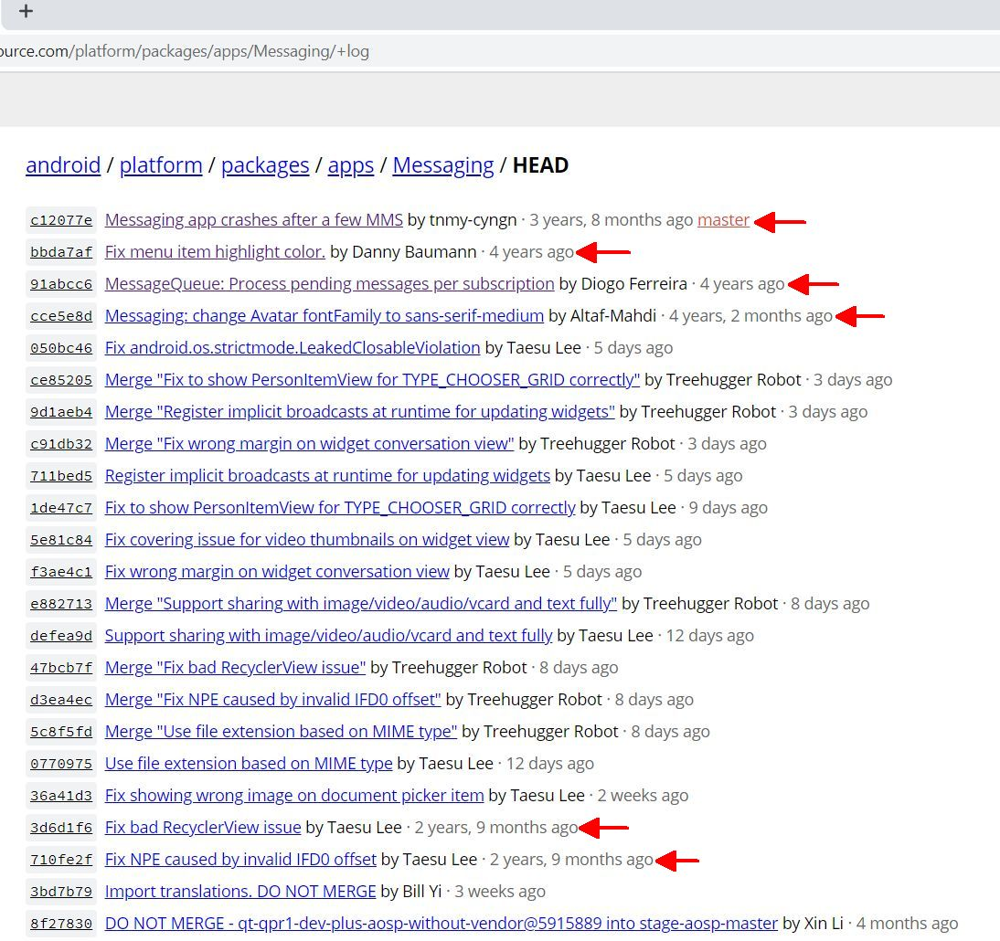

# Messaging
This is the [stock SMS app from AOSP](https://android.googlesource.com/platform/packages/apps/Messaging/), configured as an Android Studio project so that it can be built *without having to download and compile all of AOSP*. It builds with Gradle Plugin version 3.5.3 and Build Tools version 29.0 using Android Studio 3.5.3

~~This repo does not follow the upstream master branch, only certain tags.~~ This repo follows upstream master branch to get latest bug fixes.

The **goal** is not to fix and/or enhance this Google owned app outside its premises, but rather _study, observe, experiment with_ and other reasons you can think of. Source code changes, if any, are kept at a minimum.

## How usable is this?
There are 2 issues.

1. I thought this was a fairly stable app, and that I'd be good if I chose one of the recent tags to work on. Then I've _observed_ bug fixes from years(!) ago being committed to master branch. Here is a screenshot dated 15 Feb 2020:

   

   I don't know where these commits are originally kept and the amount of them. So much for being open source.
   
2. I thought this was a regularly updated and maintained app. But its `targetSdk` is stuck at 24, which is unacceptable by Google Play. Simply changing `targetSdk` to higher levels causes intermittent crashes because of the backward-incompatible changes the Android Team has progressively been introducing to the SDK.  
   *Bottomline:* if it works for you without issues, consider yourself lucky.
